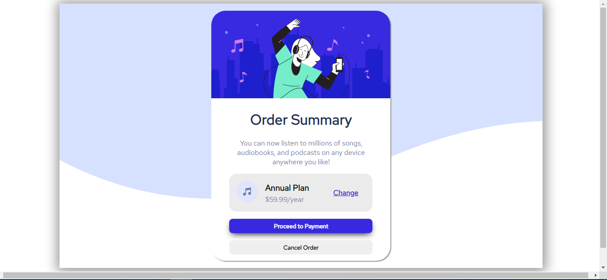

# Order-Summary-Card-Frontend-Mentor-Challenges-

This is a solution to the [Order summary card challenge on Frontend Mentor](https://www.frontendmentor.io/challenges/order-summary-component-QlPmajDUj). 

The challenge is to recreate as closely as possible the order summary card provided by Frontend Mentor. 

There's my solution:

Desktop:

Mobile:

Here are the templates provided for the challenge:

Desktop:

Mobile:
